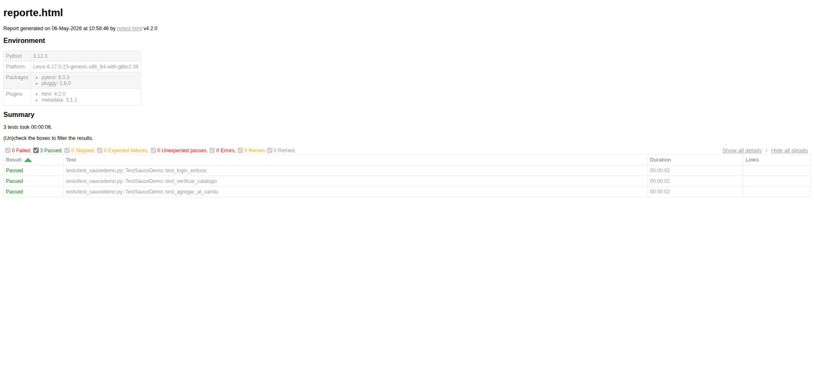

# Pre-Entrega de Proyecto: Automation Testing con Selenium - Sauce Demo

Este proyecto contiene la automatización de pruebas para el sitio **Sauce Demo**, cumpliendo con los requisitos de la formación de QA Automation. Se han aplicado técnicas de Page Object Model (simplificado), esperas explícitas y manejo de datos externos.

## 📝 Propósito del Proyecto
Validar los flujos críticos de usuario en la plataforma Sauce Demo, asegurando la integridad del proceso de login, la visualización del catálogo de productos y la funcionalidad del carrito de compras.

## 🛠️ Tecnologías Utilizadas
- **Lenguaje:** Python 3.12
- **Automatización:** Selenium WebDriver (v4)
- **Framework de Testing:** Pytest
- **Reportes:** Pytest-HTML
- **Entorno de Desarrollo:** Linux Mint
- **Manejo de Datos:** Archivos JSON

## 📂 Estructura del Proyecto
```text
pre-entrega-automation-hans-garcia/
├── datos/           # Datos externos para pruebas (usuarios.json)
├── reports/         # Reportes HTML generados y evidencias
├── tests/           # Scripts de prueba (Pytest)
├── utils/           # Funciones auxiliares y configuración del Driver
├── .venv/           # Entorno virtual de Python
└── README.md        # Documentación del proyecto
```

## ⚙️ Instalación y Configuración

1. **Clonar el repositorio:**
   ```bash
   git clone [URL-DE-TU-REPOSITORIO]
   cd pre-entrega-automation-hans-garcia
   ```

2. **Crear y activar el entorno virtual en Linux:**
   ```bash
   python3 -m venv .venv
   source .venv/bin/activate
   ```

3. **Instalar dependencias:**
   ```bash
   pip install selenium pytest pytest-html
   ```

## 🧪 Ejecución de Pruebas

Para ejecutar las pruebas y generar el reporte HTML solicitado, ejecute el siguiente comando en la terminal:

```bash
python3 -m pytest tests/test_saucedemo.py -v --html=reports/reporte.html
```

## 📊 Entregables y Reportes
- **Reporte HTML:** El resultado detallado de la última ejecución se encuentra en `reports/reporte.html`.
- **Evidencia visual:**


- **Datos Externos:** Se utiliza `datos/usuarios.json` para evitar el hardcoding de credenciales, siguiendo las mejores prácticas.
- **Validaciones:** Se incluyen asserts para URLs, títulos de sección, presencia de productos y contadores de carrito (badges).

---
## 👤 Contacto
**Autor:** Hans Garcia  
[](https://linkedin.com)  
[](https://hans-rafael.dev)

*Proyecto realizado para la Pre-Entrega de QA Automation.*

